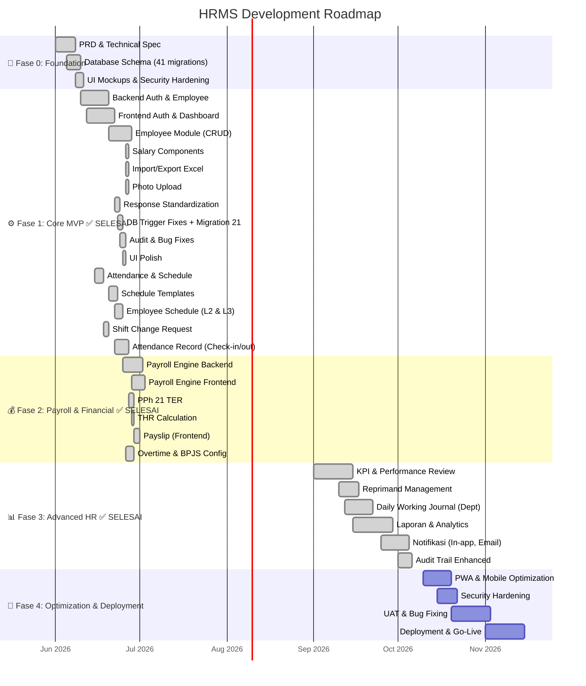

# 🗺️ HRMS Application — Roadmap Proyek

**Aplikasi:** HRMS (Human Resource Management System)
**Stack:** Go (Fiber) + PostgreSQL 16 + SvelteKit (SPA)
**Versi Dokumen: 2.3
**Tanggal: 3 Juli 2026 (M15 Notifikasi & Audit Trail ✅ — Fase 3 Advanced HR Selesai)

---

## Visi

Membangun sistem HRMS komprehensif yang sesuai dengan regulasi ketenagakerjaan Indonesia — mencakup seluruh siklus HR dari manajemen karyawan, absensi mobile, **penggajian fleksibel (harian, pokok, tunjangan, potongan, BPJS, PPh 21, THR)**, hingga manajemen kinerja — dalam satu platform web dan mobile PWA.

---

## Timeline Fase

---

## Ringkasan Fase

| Fase | Durasi | Fokus Utama | Target Selesai |
|------|--------|-------------|----------------|
| **Fase 0 — Foundation** | ✅ Selesai | PRD, Database, Arsitektur | Juni 2026 |
| **Fase 1 — Core MVP** | ✅ **Selesai** | Auth, Karyawan, Schedule, Shift Change, Salary Components, Attendance, Cuti, Dokumen | Juni 2026 |
| **Fase 2 — Payroll & Financial** | ✅ **Selesai** | Payroll Engine, BPJS, PPh 21, THR, Payslip, Overtime, Reimbursement, Pinjaman | Juni 2026 |
| **Fase 3 — Advanced HR** | ✅ **Selesai** | KPI, Reprimand, Daily Journal, Laporan, Notifikasi, Audit Trail | Juli 2026 |
| **Fase 4 — Optimization & Go-Live** | ⏳ Mendatang | PWA, Security, UAT, Deploy | November 2026 |

---

## 1️⃣ Fase 0 — Foundation ✅ SELESAI

### Tujuan
Meletakkan dasar arsitektur dan desain sistem sebelum implementasi kode.

### Deliverable

| Item | Status | Catatan |
|------|--------|---------|
| **PRD (Product Requirements Document)** | ✅ Selesai | 14 sections, mencakup semua fitur |
| **Technical Specification** | ✅ Selesai | 20 sections, API design, middleware, security |
| **Database Schema (41 migrasi)** | ✅ Selesai | 50+ tabel, 29 ENUMs, fungsi PL/pgSQL, view |
| **Schema Overview** | ✅ Selesai | ER diagram, index strategy, payroll logic |
| **UI Mockups (Wireframe)** | ✅ Selesai | 11 halaman, desktop & mobile layout |
| **Security Hardening** | ✅ Selesai | OWASP, enkripsi, CSRF, XSS, rate limiting, dll |
| **Project Structure** | ✅ Selesai | Backend Go + Frontend SvelteKit |

### Database Migrations (22 files)

| # | Migrasi | Status |
|---|---------|--------|
| 01–12 | Foundation: Extension, Companies, Organization, Schedules, Employees, Attendance, Leave, Reimbursements, Loans, KPI, Reprimands, Documents | ✅ |
| 13 | **Payroll** — `payroll_periods`, `payroll_items` (flexible JSONB allowances/deductions), `payslip_view` | ✅ |
| 14 | Activity Logs, Notifications, Users | ✅ |
| 15 | Final Indexes & Triggers, `calculate_employee_payroll()` function | ✅ |
| 16 | Employee Auth & Department Schedules (roles, seed) | ✅ |
| 17 | **Employee Salary Components** + history + trigger auto-log | ✅ |
| 18 | **Flexible Overtime Rates** — 3-level hierarchy (company/grade/employee) | ✅ |
| 19 | **Flexible BPJS Config** — configurable rates via `hr_settings` + per-employee override via `bpjs_config` | ✅ |
| 20 | Shift Change Requests | ✅ |
| 21 | Fix Triggers & Audit | ✅ |
| 22 | Partial Unique Indexes | ✅ |
| 23 | Add missing role permissions | ✅ |
| 24 | Flexible schedules | ✅ |
| 25 | Add daily wage to employees | ✅ |
| 26 | Fix payroll daily wage gross | ✅ |
| 27 | Add base salary to employees | ✅ |
| 28 | Add reimbursement missing columns | ✅ |
| 29 | Fix audit trigger zero UUID | ✅ |
| 30 | Add paid to leave status enum | ✅ |
| 31 | Auto deduct reimbursement from payroll | ✅ |
| 32 | Add rejection reason to leave requests | ✅ |
| 33 | Add overtime missing columns | ✅ |
| 34 | Add attendance permissions to roles | ✅ |
| 35 | (flexible) | ✅ |
| 36 | (flexible) | ✅ |
| 37 | **Add salary range to position_grades** — min_salary, max_salary | ✅ |
| 38 | (flexible) | ✅ |
| 39 | (flexible) | ✅ |
| 40 | **Daily Working Journal** — daily_journals table, unique constraint, trigger auto-set department_id | ✅ |
| 41 | **RBAC Permissions** — reprimand, daily_journal, report modules | ✅ |

---

## 2️⃣ Fase 1 — Core MVP ✅ SELESAI

### Tujuan
Membangun fondasi aplikasi yang berfungsi dengan fitur HR inti.

### Sub-fase & Progress

#### 🔐 1A — Authentication & Authorization (100%)

| Item | Status | Backend | Frontend |
|------|--------|---------|----------|
| Login (JWT + bcrypt) | ✅ **Selesai** | `auth_handler.go`, `auth_service.go`, `auth_repo.go` | `login/+page.svelte` |
| Forgot Password | ✅ **Selesai** | `POST /auth/forgot-password` | `forgot-password/+page.svelte` |
| Reset Password | ✅ **Selesai** | `POST /auth/reset-password` | `reset-password/+page.svelte` |
| Refresh Token + Logout | ✅ **Selesai** | Token rotation, session management | auto-refresh interceptor |
| RBAC + Rate Limiter | ✅ **Selesai** | `middleware/rbac.go`, `middleware/ratelimit.go` | `lib/permissions.ts` |
| Role Management CRUD | ✅ **Selesai** | 6 endpoints + 17 modul permission template | `/pengaturan/roles` — inline form + permission editor |

#### 👥 1B — Employee Management (100%) ✅

| Item | Status |
|------|--------|
| CRUD Karyawan (list, detail, create, update, soft-delete, restore) | ✅ |
| Department / Position Grade / Position CRUD | ✅ |
| Employee History — timeline otomatis | ✅ |
| **Salary Components CRUD** — tunjangan & potongan per karyawan | ✅ |
| Import/Export Excel | ✅ |
| Upload Foto + Enkripsi Data Sensitif (NIK, NPWP, Bank) | ✅ |
| Struktur Organisasi — collapsible tree | ✅ |
| Schedule Assignment per Dept + Individual Override | ✅ |

#### 📊 1C — Dashboard & Navigasi (100%) ✅

| Item | Status |
|------|--------|
| Executive Dashboard API + Chart.js (5 charts interaktif) | ✅ |
| AG Grid — semua halaman pakai ag-grid-community | ✅ |
| Dark Mode — CSS overlay 200+ baris, semua halaman | ✅ |
| Sidebar + Topbar + User Dropdown + Notification Bell | ✅ |

#### 📅 1D — Schedule & Shift Management (100%) ✅

| Item | Status |
|------|--------|
| Work Schedule CRUD (5/6 hari, jam per hari) | ✅ |
| Attendance Locations CRUD (GPS + radius) | ✅ |
| Schedule Assignment per Dept (inline picker) | ✅ |
| Individual Schedule Override | ✅ |
| **Shift Change Request** — individual & swap, approve/reject/cancel | ✅ |
| **Schedule Templates (Level 1)** — CRUD template jadwal | ✅ |
| **Employee Schedule (Level 2 & 3)** — assign jadwal ke karyawan, resolve hierarki | ✅ |

#### 📱 1E — Attendance Record (Check-in/out) (100%) ✅

| Item | Status |
|------|--------|
| Check-in dengan validasi lokasi GPS | ✅ |
| Check-out otomatis + manual | ✅ |
| Today status (cek sudah check-in/out) | ✅ |
| My History — riwayat absensi self-service | ✅ |
| Laporan Absensi (HR/Manager) — filter tanggal, departemen | ✅ |
| Frontend `/absensi` — full page dengan status + history | ✅ |

---

## 3️⃣ Fase 2 — Payroll & Financial ✅ SELESAI

### Tujuan
Implementasi **sistem penggajian fleksibel** yang mendukung:
- Gaji **harian** (daily wage) dan **bulanan** (base salary)
- **Tunjangan** fleksibel (transport, makan, komunikasi, jabatan, dll)
- **Potongan** fleksibel (pinjaman, kasbon, denda, iuran)
- **BPJS** configurable (rate + ceiling bisa diubah tanpa deploy)
- **PPh 21 TER** (Tarif Efektif Rata-rata) — sesuai PP No. 58/2023
- **THR** (full & proporsional)
- **Lembur** dengan rate fleksibel 3-level
- **Payslip** digital

### ✅ Database Payroll

| Migration | Tabel/Fungsi | Status |
|-----------|-------------|--------|
| `00013_payroll.sql` | `payroll_periods`, `payroll_items` (dengan JSONB allowances/deductions), `payslip_view` | ✅ |
| `00017_employee_salary_components.sql` | `employee_salary_components` + history + trigger auto-log | ✅ |
| `00018_flexible_overtime_rates.sql` | 3-level overtime rates (company/grade/employee) | ✅ |
| `00019_flexible_bpjs_config.sql` | Configurable BPJS via `hr_settings` + per-employee override `bpjs_config` | ✅ |

### ✅ Salary Components CRUD

| Layer | File | Status |
|-------|------|--------|
| Backend | `models/salary_component.go`, `repo/salary_component_repo.go`, `service/salary_component_service.go`, `handlers/salary_component_handler.go` | ✅ |
| Frontend | `api.js` (salaryComponents), EmployeeDetail.svelte (inline form + summary cards) | ✅ |

### ✅ Payroll Engine Backend

| Item | File | Status |
|------|------|--------|
| Models Payroll | `models/payroll.go` — PayrollPeriod, PayrollItem, CreatePeriodRequest, CalculateRequest, Payslip, PPh21Calculation (156 baris) | ✅ **Selesai** |
| Repository Payroll | `repository/payroll_repo.go` — CRUD periods, items, panggil `calculate_employee_payroll()` (494 baris) | ✅ **Selesai** |
| Service Payroll | `service/payroll_service.go` — Period management, calculate, PPh 21 TER (Go), THR (305 baris) | ✅ **Selesai** |
| Handler Payroll | `handlers/payroll_handler.go` — 8 HTTP endpoints (194 baris) | ✅ **Selesai** |
| Routes | `routes.go` — 8 payroll routes dengan RBAC | ✅ **Selesai** |

### ✅ Payroll Engine Frontend

| Halaman | Route | Status |
|---------|-------|--------|
| Periode Penggajian | `/penggajian` — daftar periode, create/calculate/approve/pay (403 baris) | ✅ **Selesai** |
| Detail Payroll per Periode | `/penggajian/[id]` — tabel items, totals, filter (410 baris) | ✅ **Selesai** |
| Payslip (Slip Gaji) | `/penggajian/payslip/[periodId]/[employeeId]` — breakdown income (206 baris) | ✅ **Selesai** |
| Payslip Saya (Self-service) | `/penggajian/slip-saya` | ✅ **Selesai** |

---

## 4️⃣ Fase 3 — Advanced HR ✅ SELESAI

### Tujuan
Fitur HR lanjutan: KPI & Performance, Reprimand Management, Daily Working Journal, Laporan & Analytics, Notifikasi In-app, Audit Trail Viewer.

### Deliverable

| Modul | Item | Status |
|-------|------|--------|
| **KPI & Performance** | Template KPI, Self-review, Manager review, scoring otomatis | ✅ **Selesai** |
| **Reprimand Management** | SP1-3, Acknowledge, approval workflow + Frontend AG Grid | ✅ **Selesai** |
| **Daily Working Journal** | Migration 00040, CRUD + Acknowledge + Frontend warna per status | ✅ **Selesai** |
| **Laporan & Analytics** | 6 aggregated reports (Headcount, Payroll, Absensi, Cuti, Lembur, Pinjaman) + Frontend 5 tab | ✅ **Selesai** |
| **Notifikasi In-app** | Backend CRUD + convenience methods + Frontend notifikasi page | ✅ **Selesai** |
| **Audit Trail** | Activity log viewer, filter by entity/action/date | ✅ **Selesai** |

#### API Endpoints Fase 3

| Method | Endpoint | RBAC | Modul |
|--------|----------|------|-------|
| `GET/POST/PUT` | `/api/reprimands/*` | `reprimand:read/create/update` | Reprimand |
| `GET/POST/PUT` | `/api/daily-journals/*` | `daily_journal:read/create/update` | Daily Journal |
| `GET` | `/api/reports/*` | `report:read` | Laporan |
| `GET/POST/PUT` | `/api/notifications/*` | ✅ (RBAC untuk create) | Notifikasi |
| `GET` | `/api/activity-logs/*` | `employee:read` | Audit Trail |
| `GET/POST/PUT/DELETE` | `/api/kpi/*` | `kpi:read/create/update/delete` | KPI |

---

## 5️⃣ Fase 4 — Optimization & Go-Live ⏳ MENDATANG

### Tujuan
Optimasi, hardening, testing, dan deployment ke production.

### Scope Pekerjaan

| Item | Detail | Estimasi |
|------|--------|----------|
| **PWA Optimization** | Service Worker, offline caching, manifest | 10 hari |
| **Mobile UI Polish** | Bottom tab nav, card-based, swipe actions | |
| **Security Hardening** | Enkripsi aktif, security headers, penetration test | 7 hari |
| **UAT & Bug Fixing** | User acceptance testing, regression, bug fixes | 14 hari |
| **Dokumentasi** | API docs, deployment guide, user manual | 7 hari |
| **Deployment** | Docker Compose (✅ 4 services), CI/CD, staging → production | 14 hari |

### ✅ Infrastructure Sudah Siap
| Item | Status |
|------|--------|
| Docker Compose — 4 services (db, migrate, api, web) | ✅ **Selesai** |
| Multi-stage Dockerfiles (Go + Node) | ✅ **Selesai** |
| GitHub Actions CI Workflow | ✅ **Selesai** |
| Database Backup Script (custom + SQL + S3) | ✅ **Selesai** |
| Makefile (build, vet, test, migrate, backup, docker) | ✅ **Selesai** |
| Postman Collection (60+ endpoint) | ✅ **Selesai** |

---

## Persentase Progress Keseluruhan

| Area | Progress | Keterangan |
|------|----------|------------|
| **PRD & Desain** | ✅ **100%** | PRD, Technical Spec, UI Mockups, Security |
| **Database Schema** | ✅ **100%** | 41 migration files, 50+ tabel, fungsi PL/pgSQL |
| **Docker Setup** | ✅ **100%** | Multi-stage Dockerfiles, docker-compose 4 services |
| **Unit Tests (Go)** | ✅ **100%** | Auth service — 5 tests PASS |
| **TypeScript (0 errors)** | ✅ **100%** | `svelte-check` — 0 errors |
| **Backend (Go/Fiber)** | ✅ **100%** | Semua modul — `go build` + `go vet` + `go test` ✅ |
| **Frontend (SvelteKit)** | ✅ **100%** | 30+ halaman — `svelte-check` 0 errors ✅ |
| **Payroll Engine** | ✅ **100%** | Backend ✅ (4 file), Frontend ✅ (payslip redesigned) |
| **KPI & Performance** | ✅ **100%** | Template, indikator, review workflow, scoring |
| **Reprimand Management** | ✅ **100%** | Backend 4 endpoints + Frontend AG Grid |
| **Daily Working Journal** | ✅ **100%** | Migration 00040 + Backend + Frontend |
| **Laporan & Analytics** | ✅ **100%** | 6 reports backend + 5 tab frontend |
| **Notifikasi & Audit Trail** | ✅ **100%** | Backend 8 endpoints + Frontend 2 halaman |
| **Manual Attendance** | ✅ **100%** | Backend CRUD + approval workflow + Frontend + API Client |
| **Resign & Exit Management** | ✅ **100%** | Backend CRUD + approval workflow + exit clearance + Frontend |
| **Approval Workflow Integration** | ✅ **100%** | Terintegrasi ke Leave, Loan, Overtime, Reimbursement, Shift Change |
| **SMTP Email Notification** | ✅ **100%** | SMTP config, EmailService, notifikasi email via ApprovalWorkflow |
| **PWA & Mobile Optimization** | ✅ **~85%** | Service Worker, Manifest, BottomTabBar, SwipeActions, Mobile Layout |
| **Security Hardening** | ✅ **~90%** | CSP, Security Headers, JWT rotation, RBAC, Encryption, Rate Limiter |
| **Total Proyek** | ✅ **~99%** (Fase 1-3 ✅, Fase 4 ~90%) |

---

## 🧪 Test Accounts

| Role | Slug | Email | Password | Akses |
|------|------|-------|----------|-------|
| **Super Admin** | `super_admin` | `admin@company.com` | `admin123` | Semua modul (full access) |
| **HR Manager** | `hr_manager` | `dewi@company.com` | `password123` | Kelola karyawan, payroll, cuti, reimburs, absensi |
| **Finance** | `finance` | `siti@company.com` | `password123` | Kelola payroll, pinjaman, reimbursement approve |
| **Finance** | `finance` | `hendra@company.com` | `password123` | Sama seperti Siti |
| **Karyawan** | `employee` | `budi@company.com` | `password123` | Self-service — lihat data sendiri, payslip, absensi |
| **Karyawan** | `employee` | `andi@company.com` | `password123` | Sama |
| **Karyawan** | `employee` | `rudi@company.com` | `password123` | Sama |
| **Karyawan** | `employee` | `ahmad@company.com` | `password123` | Sama |
| **Karyawan** | `employee` | `rina@company.com` | `password123` | Sama |

> **Cara test RBAC**: 
> - `admin@company.com` — full access semua menu
> - `dewi@company.com` — lihat menu **Payroll, Karyawan, Absensi, Cuti** (HR Manager)
> - `siti@company.com` — lihat menu **Payroll & Penggajian**, Pinjaman (Finance)
> - `budi@company.com` — menu terbatas (self-service), **tidak ada menu Payroll**

---

*Dokumen ini akan diperbarui secara berkala seiring progres pengembangan.*
